CUDA Path Tracer
================

**University of Pennsylvania, CIS 565: GPU Programming and Architecture, Project 3**

  

    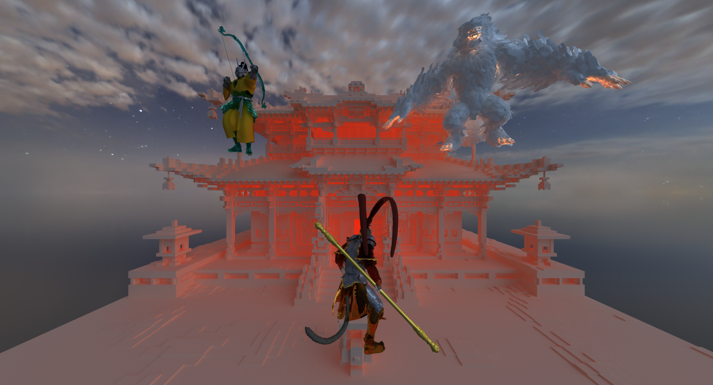
  

<table>
  <tr>
    <td align="center">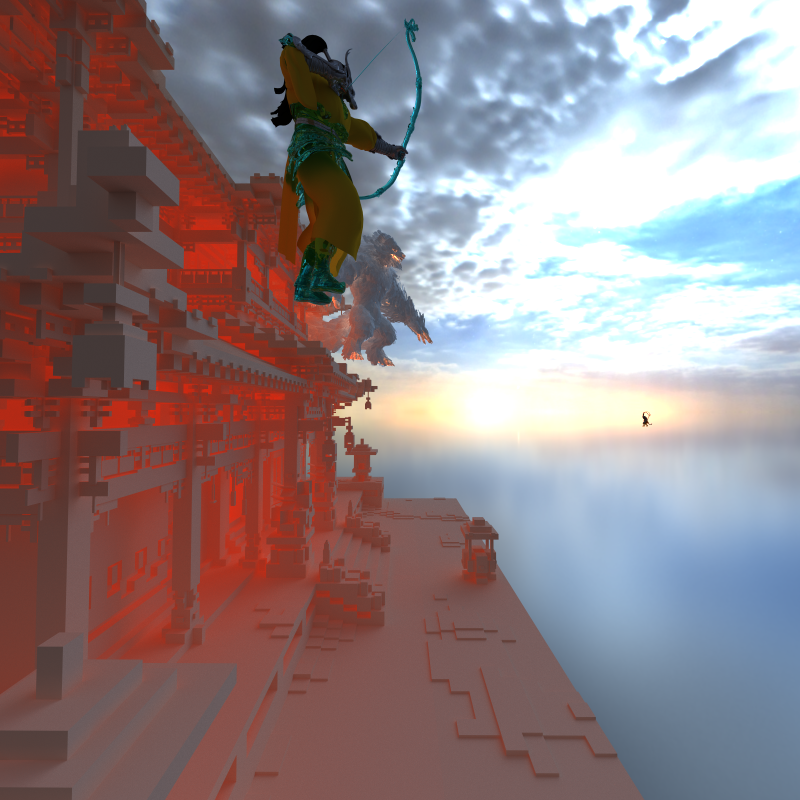</td>
    <td align="center">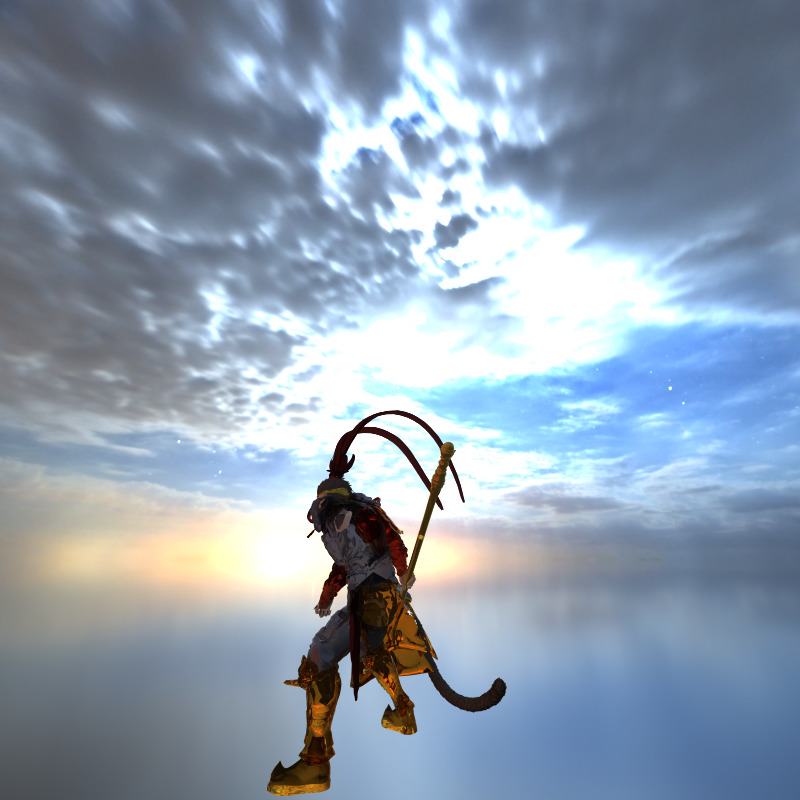</td>
  </tr>
</table>

Set `../scenes/wukong.json` in `Project Properties` to load this scene. You can find all the .obj and the corresponding .mtl in  `../scenes/blackmyth/`. It also use the background scene `kloppenheim_07_puresky_4k.hdr` in the same folder.

* Yuntian Ke
* Tested on: Tested on: Windows 11, Intel Core Ultra 9 275HX @ 2.70GHz 32GB, RTX 5070 Ti 30160MB

## Implemented Feature

### Part 1
- Ideal diffuse surfaces 
- Sort by material
- Stochastic sampled antialiasing - just set `#define enableAA  1`.
  

    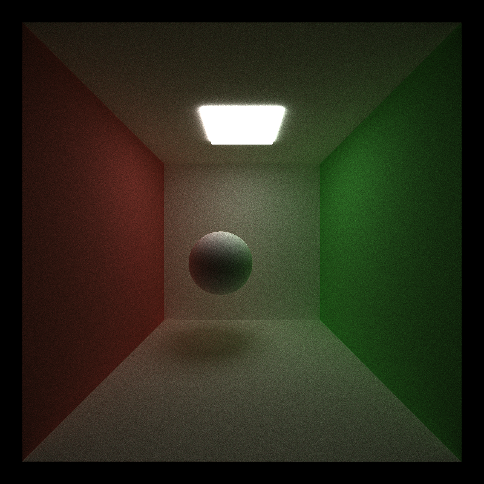
  

This picture shows the ideal diffuse sphere after 700 interations with orting by material and stochastic sampled antialiasing. To have an ideal diffuse sphere, just use cosine-weighted hemisphere sampling. Sort by material here does not improve the performance much here, since this scene contains so few materials. But sort by material can improve the performance when there are more materials, as it handle the problem of warp divergence (many threads wait while the others execute a different material). For  Stochastic sampled antialiasing, I randomly samples a point inside the pixel per iteration, reducing jagged edges.

### Materials
<table>
  <tr>
    <td align="center">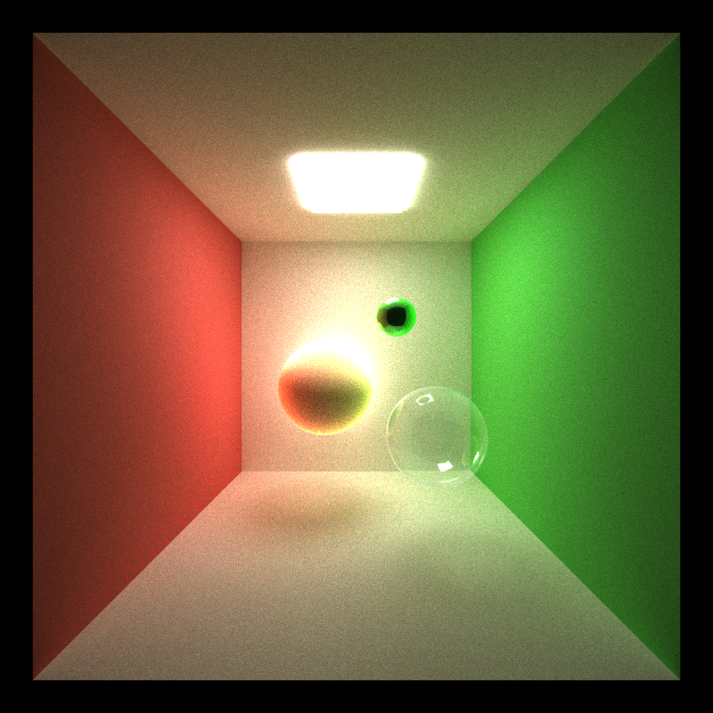</td>
    <td align="center">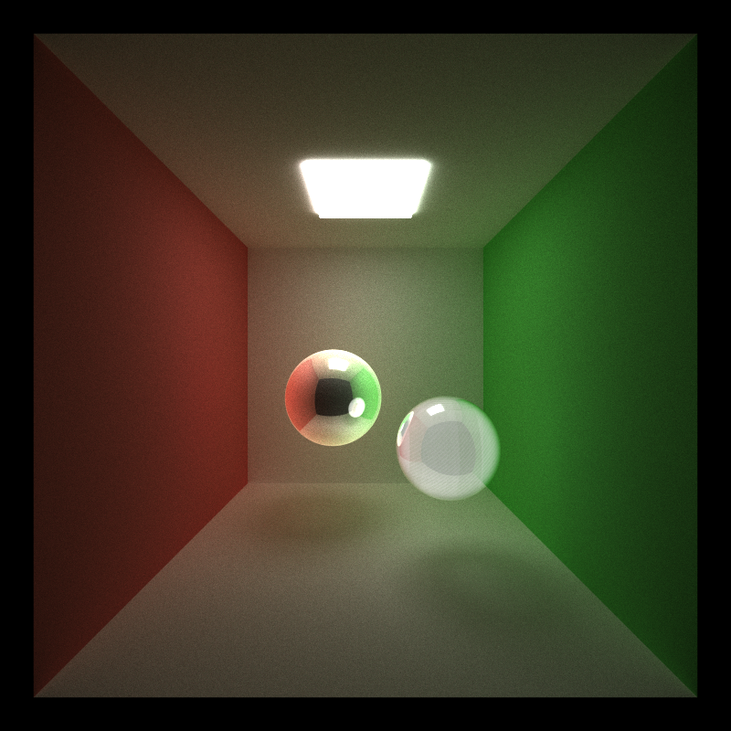</td>
  </tr>
</table>
<table>
  <tr>
    <td align="center">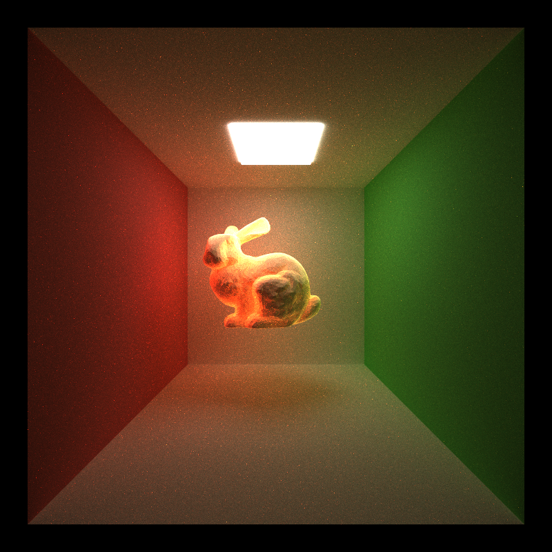</td>
    <td align="center">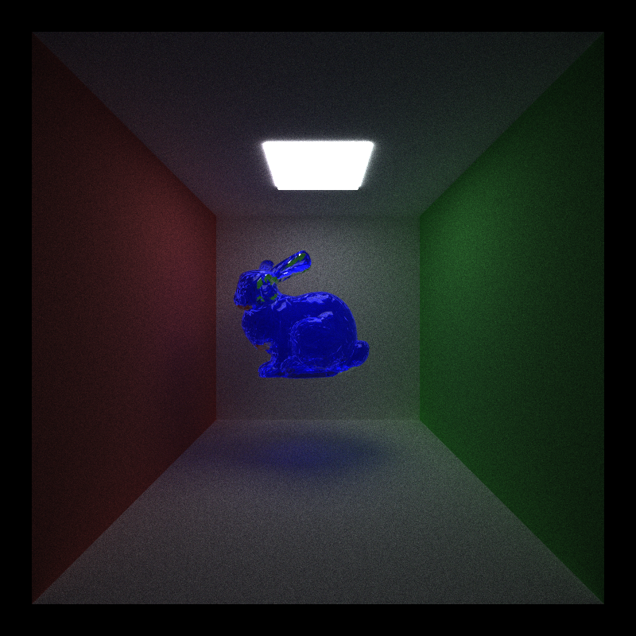</td>
  </tr>
</table>

- **Ideal specular** - the green sphere in the top-left picture.
- **Probability splits between diffuse and specular** - the sphere in the center of the top-right picture.
- **Refraction with Frensel effects** - I implemented two kind of mode, **Thin surface approximation** and **Thick Refraction(dielectric)**. The first one, thin surface refraction, treats the surface as a zero-thickness transparent sheet, similar to a window pane or cornea. It uses the Fresnel term to probabilistically choose between reflection and straight transmission (no bending), you can see the example in the top-right picture.  
The second one, this mode models a solid refractive medium, like glass, crystal, or water, using Snell’s law and Fresnel equations. In the top-left picuture, I have a hollow glass spheres, I build it by creatinig two glass sphere, one is slightly smaller and inside the other one, and flip the surface normal to create this hollow glass effect. Besides, the bunny in the bottle-right picture, is a simulation of a blue glass hollow object contains water inside.
- **Subsurface scattering** - I implemented Subsurface Scattering (SSS) to simulate the soft, translucent appearance of materials such as skin, and wax. The shader samples a scattering radius based on the material’s absorption $\sigma_a$ and scattering $\sigma_s$ coefficients, then generates a new exit point slightly offset from the entry position to model light diffusion beneath the surface. I uses a two-exponential dipole sampling model, allowing both short-range (fast) and long-range (slow) scattering components to contribute realistically. Also, a Henyey–Greenstein phase function (controlled by m.hgG) determines the outgoing scattering direction, blended with a small amount of Lambertian diffuse to simulate the soft falloff at grazing angles.     
The sphere in the center of top-left picture and the bunny in the bottom-left picture are both the example of simulating skin. 

## Depth of Field
Below pictures are the comparison of using not using physically-based depth-of-field. The scene contains an ideal specular green sphere, a white sphere enables probability splits between diffuse and specular, and a hollow glass cube. To load this scene, you can just set `../scenes/sphere.json` in `Project Properties`. The right picture uses `"APERTURE": 2.0`,`"FOCAL_DISTANCE": 11.5`, which makes object other than the center one will get blurred.

</table>
<table>
  <tr>
    <td align="center"></td>
    <td align="center">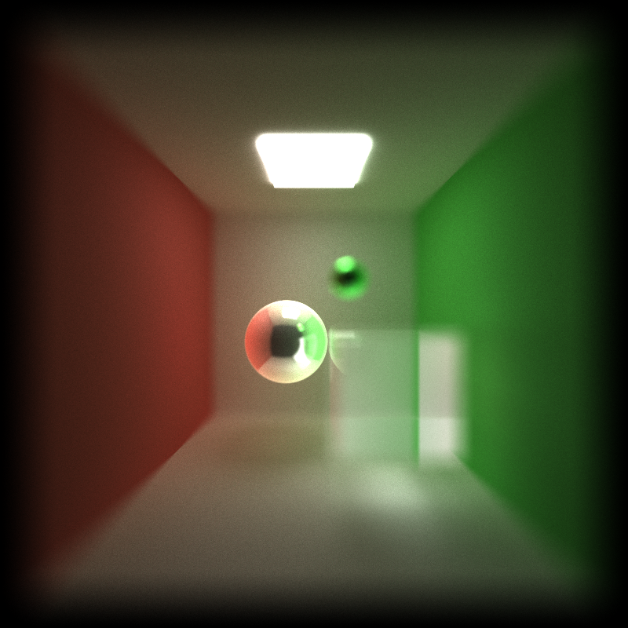</td>
  </tr>
</table>

To enable DOF, just set `#define ENABLEDOF 1`. This path tracer supports a thin-lens camera model. Primary rays are sampled from a finite aperture and aimed at a focus plane, producing realistic background/foreground blur.

## Obj mesh loading and rendering
- Obj Loading - I used TinyOBJLoader to import mesh geometry from standard .obj files and convert them into internal Triangle primitives with per-vertex normals, material IDs, and world-space transformations. You can find TinyOBJLoader under `third_party/tinyobjloader-release`.  
**To use `tiny_obj_loader.h`, just add `third_party`'s path to `Additional Include Directories` under `C/C++` in `Project Properties`.**
- Triangle intersection test - I implemented the **Möller–Trumbore algorithm**. It solves the intersection point directly using barycentric coordinates without explicitly computing the plane equation, making it efficient for GPU execution. My implementation follows the derivation and explanation from the excellent Scratchapixel tutorial [Reference](https://www.scratchapixel.com/lessons/3d-basic-rendering/ray-tracing-rendering-a-triangle/moller-trumbore-ray-triangle-intersection.html).
- Bounding volume intersection culling - By first testing AABBs and only computing triangle intersections inside them, the renderer minimizes unnecessary computations and achieves high performance on large scenes.

</table>
<table>
  <tr>
    <td align="center">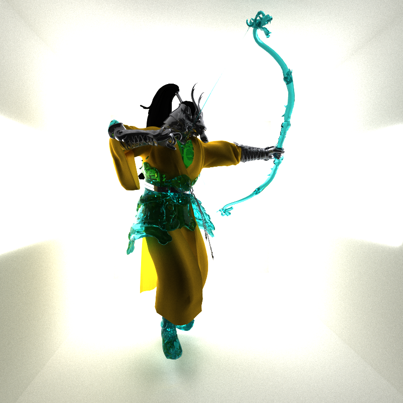</td>
    <td align="center">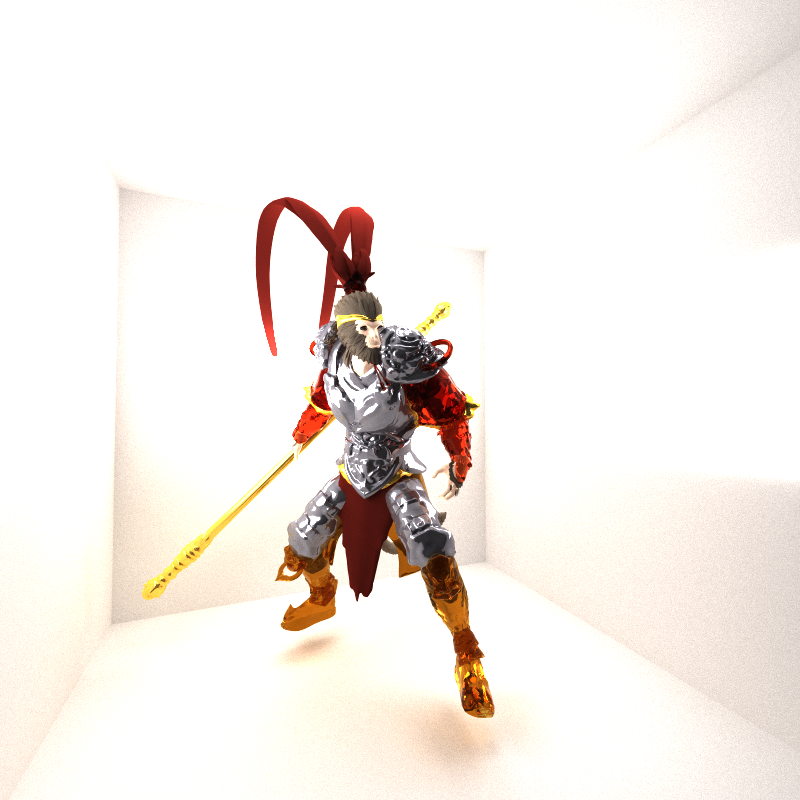</td>
  </tr>
</table>

Those are two examples of my Obj Loading. To load Sun Wukong, you can just set `../scenes/meshload.json` in `Project Properties`, and it uses `../scenes/blackmyth/wukong.obj`.  
If you want to change to load the Solider in the left picture, you can change  `../scenes/blackmyth/wukong.obj` to `../scenes/blackmyth/eagle.obj` in `meshload.json` and you may also need to change the position and the scale of the model in `meshload.json`.
I used refraction material, subsurface material (Sun Wukong's skin) and also diffuse, specular and material that enable probability splits between diffuse and specular in those models. 

## Russian roulette path termination
To optimize path tracing performance, I implemented Russian Roulette to probabilistically terminate rays with low contribution after several bounces. This technique reduces unnecessary computation from rays that contribute little to the final image while keeping the overall estimator unbiased. This algorithm give brighter rays (higher contribution) a higher chance to survive, and if the path survives, its color is divided by Russian Roulette probability to preserve energy.   
To enable this, just set `#define enableRussianRoulette 1`. The performace increases from 68 FPS to 80 FPS in my  `../scenes/sphere.json`.

## BVH
To significantly improve ray tracing performance, I implemented a Bounding Volume Hierarchy (BVH) for efficient ray–scene intersection. Take the bunny I showed before as an example. Before I add BVH, it only have 1.3 FPS, and took me an hour to run 5000 iterations. But after having BVH, it can be faster than 50 FPS, which save my time a lot. To eanble this, just set `#define enableBVH 1`
### Construction
- Compute an AABB for every triangle or mesh.
- Recursively split primitives along the longest axis of their bounding box at the median centroid position.
- Create internal nodes for partitions, and continue until each leaf contains a small number of triangles.
- Store nodes in a linear array for GPU traversal.

### Traversal 
At render time, BVH traversal occurs entirely on the GPU. If the ray misses the box, then skip this node and its children. This help to reduce intersection cost from $O(n)$ to $O(\log n)$.

## Environment Mapping and converted to Cubemap

</table>
<table>
  <tr>
    <td align="center">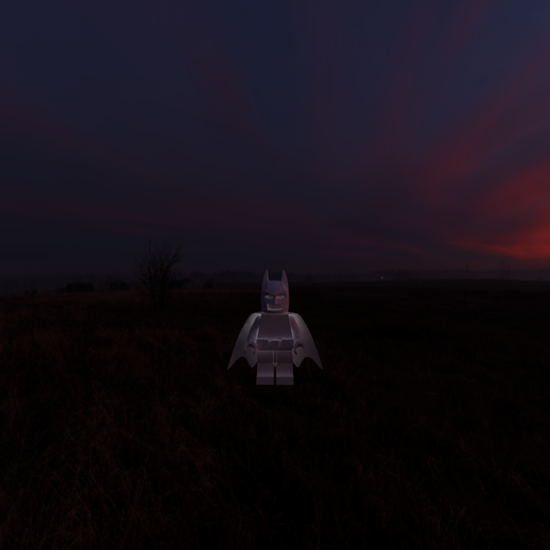</td>
    <td align="center">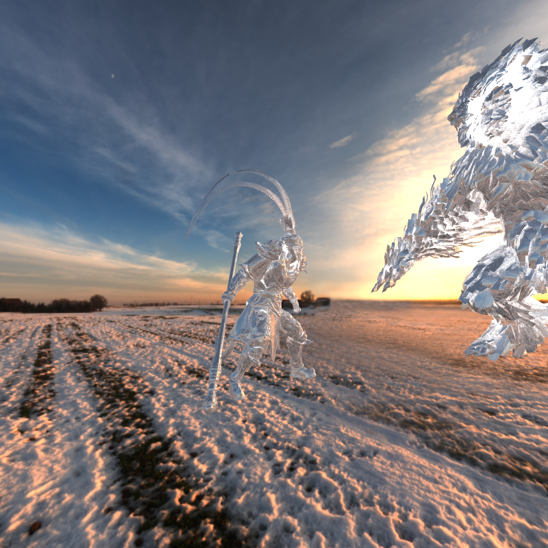</td>
  </tr>
</table>

To enable realistic global illumination and reflections, I implemented environment mapping that uses HDR images to simulate distant lighting. When a ray does not intersect any object, the renderer samples the environment map instead of returning black. This allows the entire scene to be lit by the HDR background, producing natural reflections, sky illumination, and soft ambient light without additional light sources. Besides, for higher sampling efficiency and better reflection lookup, I implemented conversion from equirectangular HDR to a 6-face cubemap format. The cubemap provides uniform sampling and avoids distortion near poles that occur in equirectangular maps.   
Those are two samples of my Environment Mapping, a Logo Batman at the night, and a silver Sun Wukong is in the air above a snowy landscape.

## Analysis
- **Stream Compaction** - Before compaction: still launch kernels over the original array (many dead rays), so a lot of threads do nothing → wasted work & divergence. With compaction: After each bounce, remove terminated paths so the next intersect/shade kernels run only on the live tail → fewer threads, better cache/warp utilization.
- **Open and Closed Scene** - Open scene: Ray counts drop fast. Many rays hit the environment or a light and terminate early. So compaction benefit will be high. Closed scene: Ray counts stay high until Russian Roulette involve; rays can’t exit, so they keep bouncing.

## Bloopers
</table>
<table>
  <tr>
    <td align="center">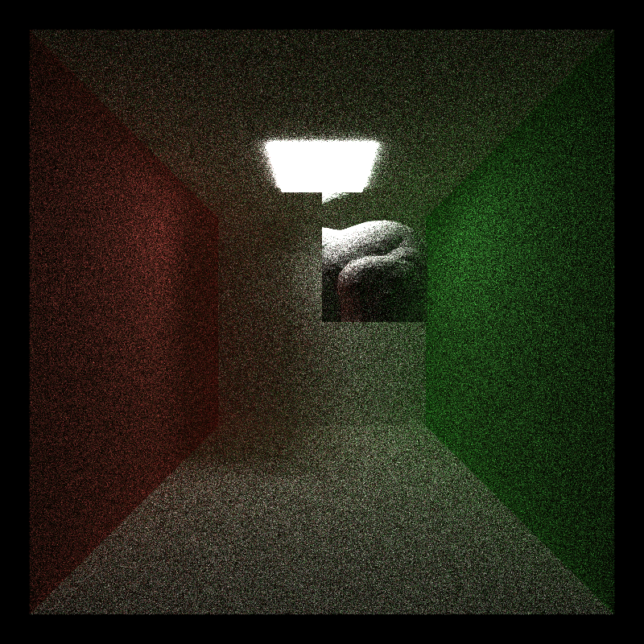</td>
    <td align="center">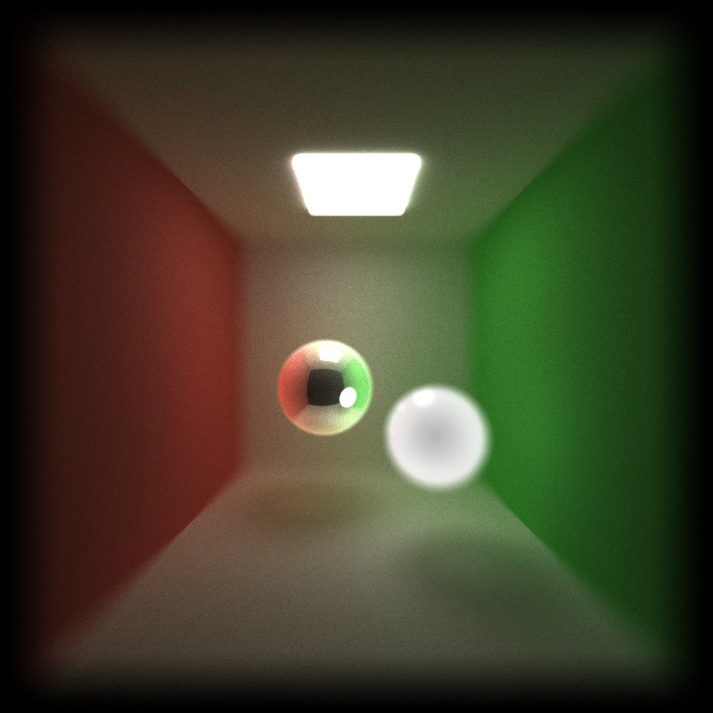</td>
  </tr>
</table>

**Broken AABB Traversal** This bug happened when a ray direction component was nearly parallel to one of the box axes. The fix was to explicitly handle near-zero directions.  
**Double-EPS Hit Point** There is already a tiny epsilon in `getPointOnRay`, and I set my own epsilon in `scatterRay`. This double offset pulled the hit point back inside the surface, so refraction started from the wrong medium. On a hollow glass sphere (two shells with flipped inner normals), this collapsed the thin air gap and made it render like solid glass. The fix was to just use add one epsilon.

